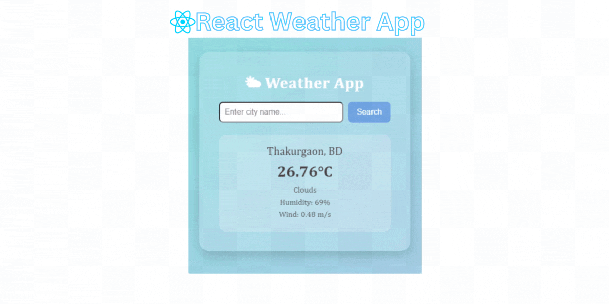

# Weather Application (ReactJS)


A simple and clean Weather App built using **ReactJS**.

---

## 🌍 Live Demo

🔗 **Live Link:** [https://weather-app-by-sm.netlify.app//](https://weather-app-by-sm.netlify.app/)

*(Replace with your real deployed link)*

---

## 📝 Overview

This weather application allows users to search for real-time weather details by entering a city name. It fetches weather information such as temperature, humidity, wind speed, and weather conditions using the OpenWeatherMap API.

A simple and clean Weather App built using **ReactJS**. This app fetches real-time weather information from the **OpenWeatherMap API** and displays temperature, humidity, wind speed, and weather conditions.

---

## 🚀 Features

* Search weather by city name
* Display temperature in °C
* Shows humidity & wind speed
* Real-time API integration
* Error handling for invalid city search
* Responsive UI design

---

## 🛠️ Tech Stack

| Technology         | Description           |
| ------------------ | --------------------- |
| ReactJS            | Frontend UI Framework |
| OpenWeatherMap API | Weather Data Source   |
| CSS                | UI Styling            |

---

## 📂 Project Structure

```
src/
 ├── App.js
 ├── Weather.js
 ├── index.js
 └── App.css
```

---

## 🔧 Installation & Setup

### 1️⃣ Clone the repository

```bash
git clone https://github.com/muniralways/Weather-Application-using-ReactJS
cd weather-react-app
```

### 2️⃣ Install dependencies

```bash
npm install
```

### 3️⃣ Get your API Key

* Visit ➝ [https://openweathermap.org/](https://openweathermap.org/)
* Create an account (Free)
* Generate API Key
* Replace your API key inside `Weather.js`:

```js
const apiKey = "YOUR_API_KEY";
```

### 4️⃣ Start the app

```bash
npm start
```

---

## ✅ Usage

* Enter a city name
* Press **Enter** or click **Search**
* See weather details instantly!

---

## 🎨 UI Preview

* Input field for city
* Weather card with temperature & details

*(Add app screenshot here)*

---

## ❗ Troubleshooting

| Issue            | Solution                 |
| ---------------- | ------------------------ |
| API not working  | Check API key & internet |
| "City Not Found" | Verify correct spelling  |
| Blank screen     | Check console errors     |

---


